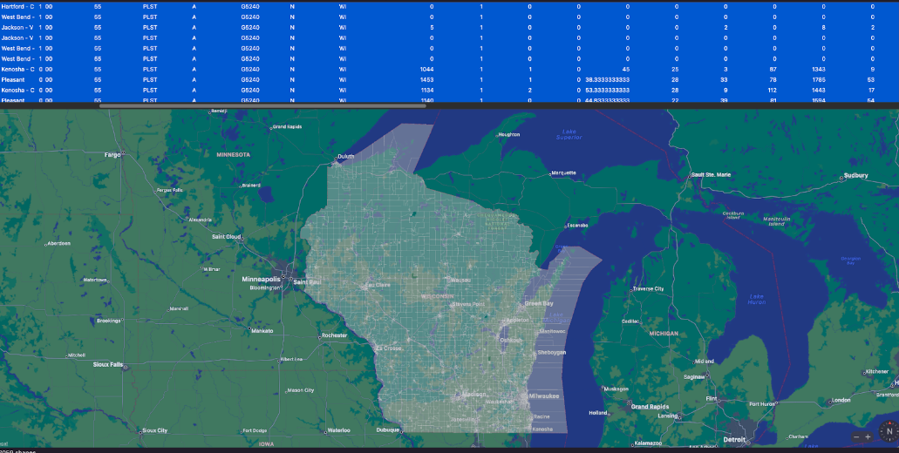
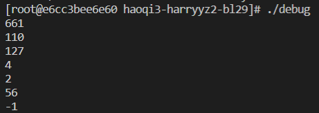
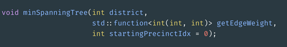
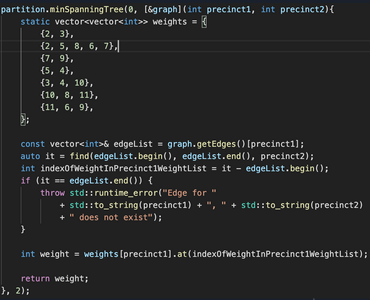
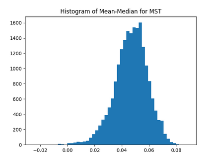
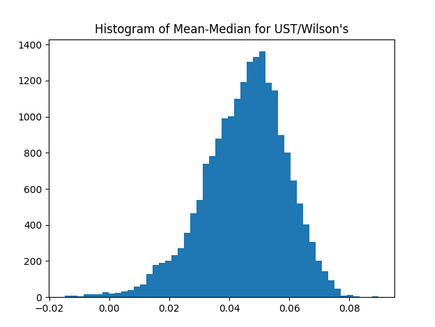
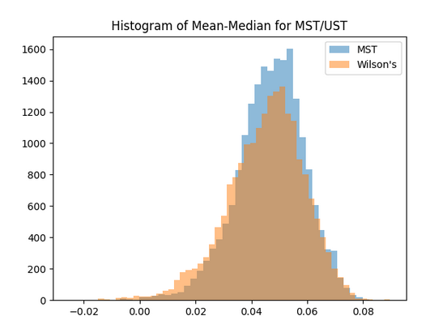
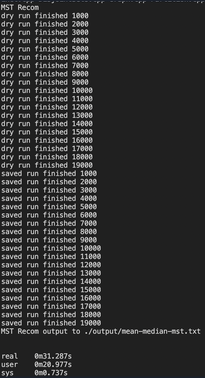
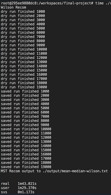
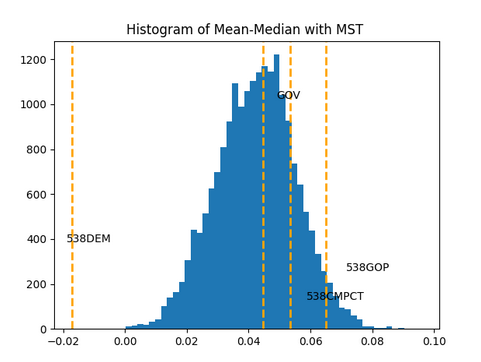

# Reasonable Redistricting Report

## Algorithms

### BFS Traversal
BFS traversal was used to find the degree of separation between separate presincts to ensure that the distribution of precincts in each state district was natural. The traversal took in 2 parameters, being the node that we start at and the node that we end at, usually differing in political leaning. It returned the number of steps to get from the first precinct to the second one. Due to the nature of state distributions, it would be impossible to have a disconnected graph, but measures are taken to prevent the program from breaking in the case of a state with disconnected precincts.

The image above shows a the distribution of precincts in Wisconsin which this project attempts to parse into districts. BFS successfully reported the distances between precincts shown below.

These tests include directly linked nodes, random nodes, and unconnected nodes.

### Minimum Spanning Tree
The implementation of the minimum spanning tree used Prim's algorithm and ran in O(|E| log |V|). The usage of minimum spanning tree resulting in a "gold standard" for the recombination algorithm. The weights of the graph were selected completely randomly as using randomly generated weights yeilded the same results as selecting from random edges. The implementation of random edges was nessesary for a fair distribution in the graph. The MST was used to generate precincts by applying the recombination algorithm and cutting along the edge that creates new balanced districts. This would repeated for the number of districts required. The function for generating a minimum spanning tree took the district, a function to generate weights as well as the index of the starting precinct and created the tree in the memory that was allocated for it. Due to the random nature of creating the MST, the following tests were implemented to ensure the algorith worked as intented:

>MST Signature

>MST Randomness Calling

>MST Testing With Control

### Uniform Spanning Tree
Using Wilson's algorithm, a uniform spanning tree was sampled out of all possible spanning trees in O(n). Applying Wilson's algorithm for a spanning tree resulted in wider distribution for the districts. Unlike using a minimum spanning tree, generating a minimum spanning tree only required the the district as the final tree would be constructed in its allocated memory by choosing from all possible trees. Construction of districts followed the same procedures as it did for MST.

The following papers were used for research on recombination and spanning trees:

[Recombination](https://hdsr.mitpress.mit.edu/pub/1ds8ptxu/release/5)

[Generating Spanning Trees](https://citeseerx.ist.psu.edu/viewdoc/download?doi=10.1.1.47.8598&rep=rep1&type=pdf)

### Testing Tree Implementations in Redistricting
Comparing the MST implementation to the UST implemenation shows differences in spread and speed.

>Spreads of districts generated with each implementation and their overlaps

>Speed comparison

### Conclusion of Leading Question

Given the image above, our algorithm can divide up a states voting presincts in an unbiased way as well as detect any potential gerrymandering that is occuring. The peak of the bell curve above represents a neutral unbiased distribution of voting districts which most recombinations would result in. Comparing these results to some real life proposals, cases of bias towards either democratic or republican parties are visible. The 538DEM proposal is considerable far from a neutral distribution and shows gerrymandering for democrat biased districts. Similarly, the 538GOP proposal skews towards a more republican biased redistricting. 538CMPCT shows a plan that was designed to be more compact and unbiased, and is placement on the graph is more in line with fair districting although it is likely that this plan could occur naturally. Finally, the governor's plan that was implemented occurs at the peak of the histogram. With this graphic, a porbability can be assigned to the likelyhood of each plan occuring and the degree of bias each plan has.
